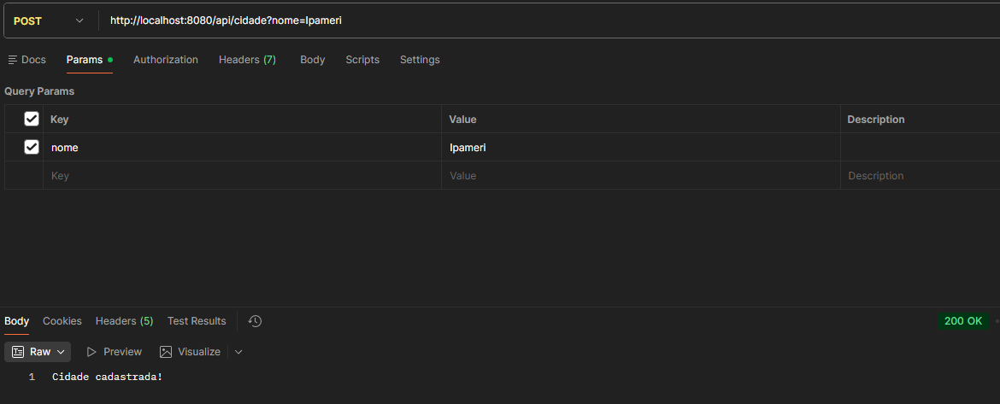
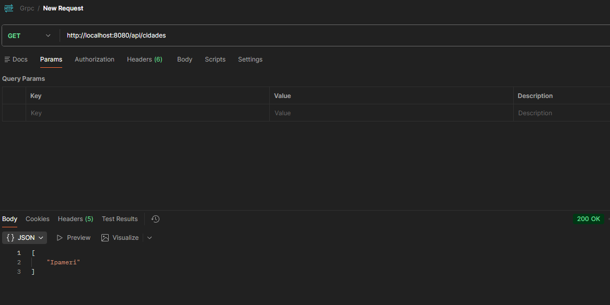
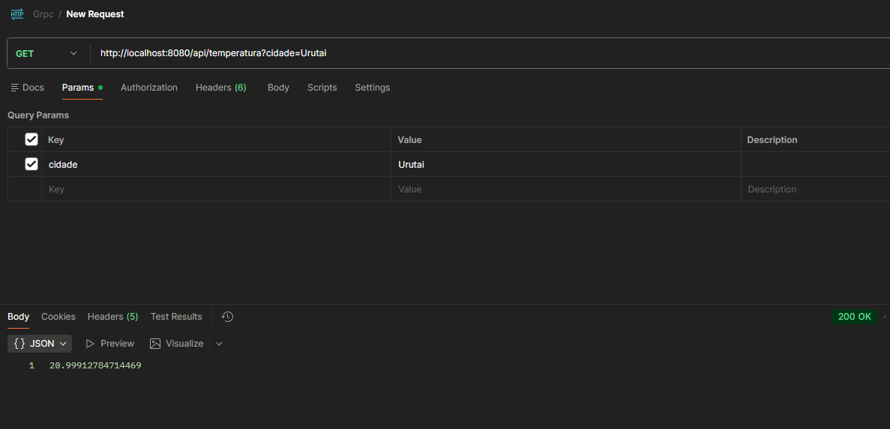
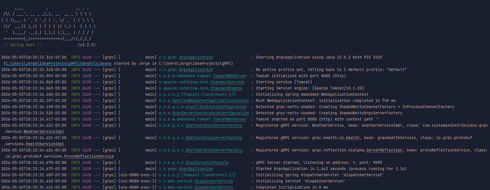

# gRPC - Sistemas Distribuídos

Este projeto consiste numa implementação de comunicação entre processos utilizando o framework **gRPC** (Google Remote Procedure Call). O objetivo é demonstrar a invocação de procedimentos remotos, a definição de contratos via Protocol Buffers e o fluxo de comunicação cliente-servidor.

## 🚀 Como rodar o projeto

### Pré-requisitos
* **Linguagem:** Java JDK 21 (Recomendado)
* **Gerenciador de Dependências:** Maven ou Gradle
* **Ferramenta gRPC:** Compilador `protoc` (geralmente integrado via plugins no Maven/Gradle)

### Passos para execução
1. **Clonar o repositório:**
   ```bash
   git clone [https://github.com/jorgearaujor/gRPC-Sistemas-Distribuidos.git](https://github.com/jorgearaujor/gRPC-Sistemas-Distribuidos.git)
   cd gRPC-Sistemas-Distribuidos
2. **Gerar os Stubs (Código gRPC):**
No diretório raiz do projeto, execute o comando de compilação para processar os arquivos .proto:

    ```bash
    mvn clean compile
    ```
3. **Iniciar o Servidor:**
Execute a classe principal do servidor (ajuste o caminho da classe conforme a sua estrutura):

    ```bash
    mvn exec:java -Dexec.mainClass="com.projeto.grpc.Server"
    ```
4. **Iniciar o Cliente:**
Em um novo terminal, execute o cliente:

    ```bash
    mvn exec:java -Dexec.mainClass="com.projeto.grpc.Client"
    ```

## 📄  Arquivo .proto
O arquivo .proto é a base do gRPC, definindo o contrato de interface e a estrutura das mensagens.

1. Definição do Serviço (service)
   Define os métodos que o servidor expõe. No gRPC, um serviço é uma coleção de métodos que podem ser chamados remotamente.

``` java
Protocol Buffers
service NomeDoServico {
rpc NomeDoMetodo (MensagemPedido) returns (MensagemResposta) {}
}
```
2. Definição das Mensagens (message)
   As mensagens são os objetos de dados trocados entre cliente e servidor. Cada campo possui um tipo e um marcador numérico (tag) que identifica o campo no formato binário.

```
Protocol Buffers
message MensagemPedido {
string texto = 1;
int32 id = 2;
}
```

3. Explicação de cada RPC implementado 

    * Chamadas Unárias: O modelo mais simples, onde o cliente envia uma requisição e recebe uma única resposta do servidor.

    * Streaming (Se aplicável): Permite o envio ou receção de múltiplos dados numa única conexão persistente.


4. Como o .proto gera código (Stubs)
   O compilador protoc lê o arquivo .proto e gera automaticamente:

   * Server Stub (Skeleton): Uma base de código que o desenvolvedor "preenche" com a lógica real do servidor.

   * Client Stub: Uma interface que o cliente utiliza para chamar os métodos remotos como se fossem funções locais da sua própria linguagem.

   * Classes de Mensagens: Objetos com métodos de serialização e desserialização binária integrados.

## 🔄 Fluxo Completo: Requisição HTTP para Chamada gRPC
Embora o programador chame um método simples, o fluxo interno utiliza o protocolo HTTP/2:

1. **Invocação:** O cliente faz uma chamada local ao método no Stub.

2. **Serialização (Marshaling)**: O gRPC converte o objeto da linguagem para o formato binário eficiente do Protocol Buffers.

3. **Encapsulamento HTTP/2**: Os dados binários são enviados através de uma conexão HTTP/2. Ao contrário do HTTP/1.1 (que usa texto/JSON), o HTTP/2 utiliza frames binários e permite multiplexação.

4. **Processamento no Servidor**: O servidor recebe os frames, reconstrói a mensagem binária para o objeto original e executa a função solicitada.

5. **Resposta**: O resultado é serializado e enviado de volta pelo mesmo túnel HTTP/2.

🖼️ Sistema em Funcionamento





Desenvolvido por Jorge Araujo
